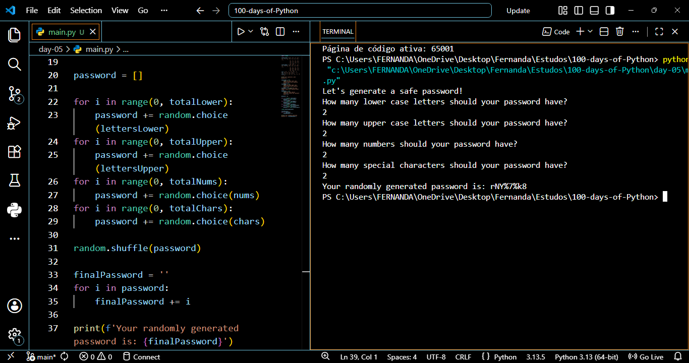

# 🎯 Day 05: Random Password Generator

## 📌 Description
A security-focused script that generates a highly secure, randomized password based on user-defined criteria for letters, numbers, and symbols.

## 🚀 Features
- Customizable Complexity: Allows the user to specify the exact count of lowercase letters, uppercase letters, numbers and special characters
- True Randomization: uses *random.shuffle()* to reorder the character list, ensuring the password does not follow a predictable pattern.
- Dynamic List Handling: Converts a list of randomly selected characters into a final concatenated string for the user.

## 🧠 What I Learned
- For Loops and Ranges: using *for i in range(0,count)* to repeat an action a specific number of times
- Random Module Methods: Utilizing *random.choice()* to pick items from a list and *random.shuffle()* to manipulate list order.
- List to String Conversion: Accumulating characters in a list and then iterating through them to build a final string


## ▶️ How to Run
```bash
python main.py
```
## 🎬 Demo
