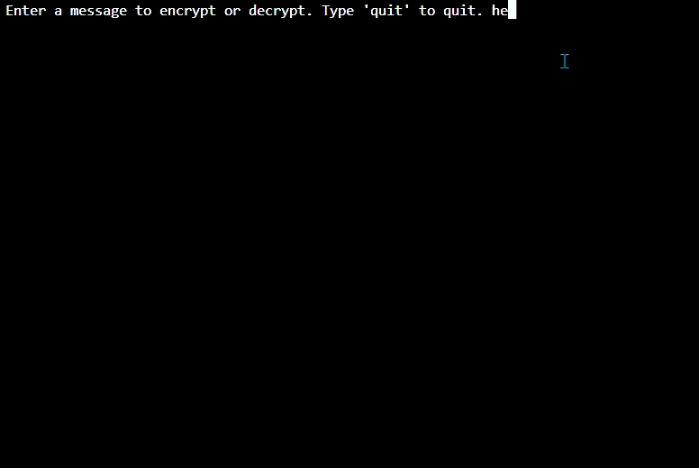

# 🔐 Day 08: Caesar Cipher

## 📌 Description
A fully functional command-line Caesar Cipher program capable of both encrypting and decrypting messages using customizable shift values. The program supports continuous usage through an interactive loop and preserves spaces and punctuation during encryption.

## 🚀 Features
- **Bidirectional Cipher Logic:** Supports both encoding and decoding using a single reusable cipher function by leveraging positive and negative shift values.
- **Alphabet Wraparound:** Uses the modulo operator `(%)` to seamlessly loop letters from `z → a` during large shifts.
- **Character Preservation:** Keeps spaces, punctuation, and non-alphabetic characters unchanged while encrypting only valid letters.
- **Interactive Runtime Loop:** Allows the user to continuously encrypt or decrypt multiple messages until choosing to quit the program.

## 🧠 What I Learned
- **Index Manipulation:** Learned how to dynamically locate character positions inside a list using the `.index()` method.
- **Modulo Arithmetic:** Used `%` to keep indexes within the bounds of the alphabet list and create circular alphabet behavior.
- **Dynamic String Building:** Constructed encrypted messages incrementally by appending transformed characters inside a loop.
- **Reusable Function Design:** Refactored duplicated encryption/decryption logic into a single generalized cipher function.
- **Loop Control:** Implemented a `while` loop with user-controlled exit conditions to create a persistent interactive program.

## 🎬 Demo


## ▶️ How to Run
```bash
python main.py
```