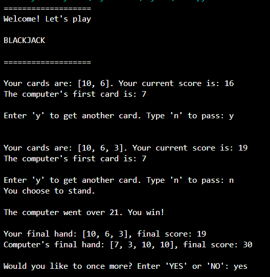

# ♠️ Blackjack Game - Python

A simple terminal-based Blackjack game built in Python as part of the **100 Days of Python** challenge.

This project was created to practice:
- Functions
- Loops
- Conditionals
- Lists
- Game logic
- User input handling
- Python problem solving

## 🎮 Features

- Random card dealing
- Blackjack detection
- Ace score adjustment (11 → 1)
- Dealer AI logic
- Score comparison
- Win/Loss/Draw system
- Interactive terminal gameplay

## 🛠 Technologies Used

- Python 3

## 📚 What I Learned

While building this project, I practiced:
- Creating reusable functions
- Managing game state with loops
- Handling user input
- Debugging logic errors
- Structuring larger Python programs

## 📸 Demo

---

---

## 👩‍💻 Author

Fernanda Schmidt

Part of my journey learning Python and software development.